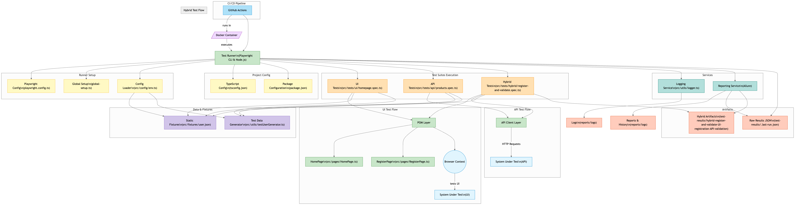

## 🚀 Playwright UI + API Hybrid Automation Framework (TypeScript)

Production-ready framework for full-stack test automation using [Playwright](https://playwright.dev/) with TypeScript.

### ✨ Features
- Page Object Model (POM)
- UI + API hybrid testing
- TypeScript strict typing
- Dynamic data with Faker
- Allure reports with history & environment info
- Logging via log4js
- CI-ready with GitHub Actions
- Code linting & formatting
- Docker support (optional)

---

## Architecture



---


## 📁 Project Structure
```
project-root/
├── .github/workflows/        # GitHub Actions workflows
│   └── playwright.yml
├── logs/                     # log4js logs
├── reports/                  # Optional reports
├── src/
│   ├── config/               # env.ts
│   ├── fixtures/             # Static data (JSON)
│   ├── pages/                # Page Object Models
│   ├── tests/                # API, UI, hybrid specs
│   └── utils/                # logger, faker data
├── .env                      # secrets (ignored)
├── global-setup.ts          # Sets Allure environment metadata
├── playwright.config.ts     # Config for Playwright test runner
├── tsconfig.json            # TypeScript compiler options
├── package.json             # Scripts & dependencies
├── .eslintrc.json           # Linter config
├── .prettierrc              # Formatter config
├── .gitignore
└── README.md
```

---

## 🧩 Setup
```bash
npm install
npx playwright install
```

Create a `.env` file from template:
```bash
cp .env.example .env
```

---

## 🧪 Run Tests
```bash
npm run test                 # Run all tests
npm run test:ui             # UI only
npm run test:api            # API only
```

---

## 📊 Allure Reporting
```bash
npm run allure:report
```
Trends visible after second run.

---

## 🤖 GitHub Actions CI
Workflow in `.github/workflows/playwright.yml`
- Installs dependencies
- Runs tests headless
- Uploads Allure results
- Publishes report (optional)

---

## 📦 Docker (optional)
```bash
docker build -t playwright-hybrid .
docker run --rm playwright-hybrid
```

---

## 🔍 Linting & Formatting
```bash
npm run lint
npm run format
```

---

## 🧪 Test Data with Faker
```ts
import { generateTestUser } from '../utils/testUserGenerator';
const user = generateTestUser();
```

---

## 🔐 Secrets
Use `.env` for secrets and dynamic config.

### .env.example
```
BASE_URL=https://automationexercise.com
ENV_NAME=QA
EXECUTOR=Satish Saripella
```

---

## ✅ Scripts in package.json
```json
"scripts": {
  "test": "npx playwright test",
  "test:ui": "npx playwright test src/tests/ui",
  "test:api": "npx playwright test src/tests/api",
  "allure:copy-history": "cp -r ./allure-report/history ./allure-results/history || echo 'no history found'",
  "allure:generate": "npx allure generate ./allure-results --clean -o ./allure-report",
  "allure:serve": "npx allure open ./allure-report",
  "allure:report": "npm run allure:copy-history && npm run allure:generate && npm run allure:serve",
  "lint": "eslint . --ext .ts",
  "format": "prettier --write ."
}
```

---

## 🧹 To Do
- [ ] Add test coverage (playwright-coverage)
- [ ] Central config for environments
- [ ] Data cleanup endpoints (if needed)

---

## 🤝 Contributing
PRs welcome! Reach out to **Satish Saripella** for questions.

---

## 🧠 Author
Maintained by Satish Saripella